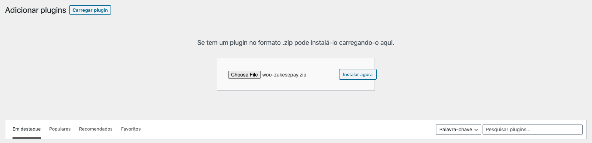
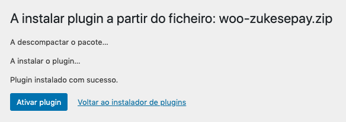
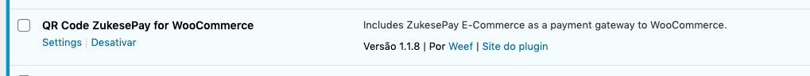
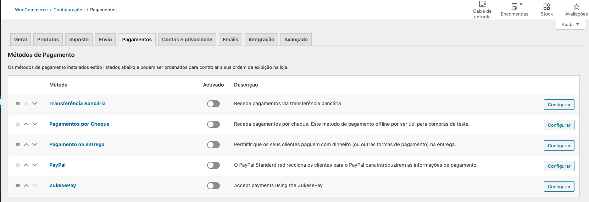
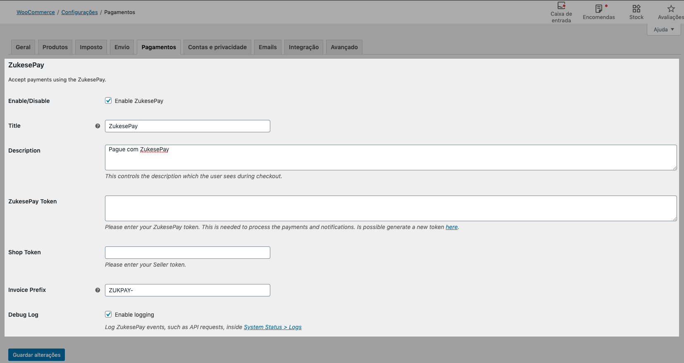
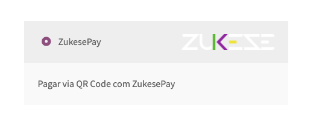
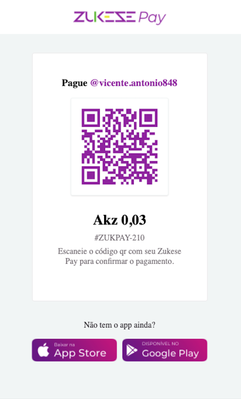
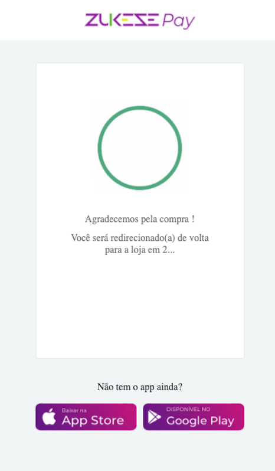
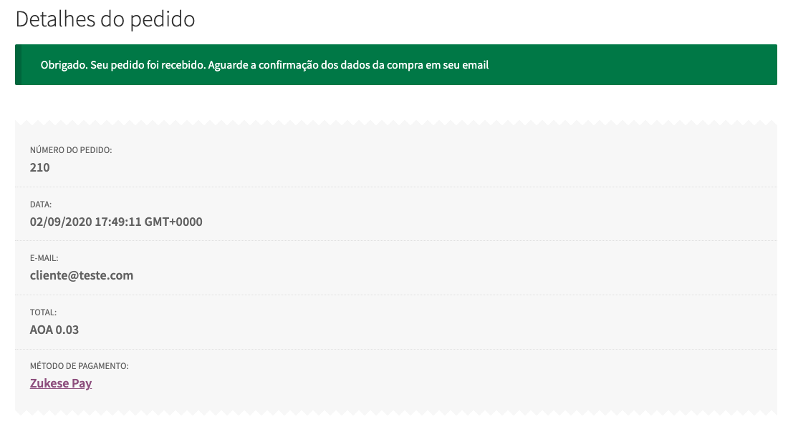

# Woo-ZukesePay - Plugin de pagamentos para o Woocommerce utilizando ZukesePay

## Sumário

* Introdução
* Requisitos
* Instalação do plugin
* Obtendo os dados da integração
* Configurando o plugin junto ao Woocommerce
* Exemplo de fluxo de pagamento

## Introdução

Esse plugin permite ao administrador da plataforma do Woocommerce, adicionar o gateway de pagamento ZukesePay ao Woocommerce.
Consulte também a [documentação da API ZukesePay](http://zukese-institucional.teste404.com.br/zukese-pay-e-commerce-api-v1-0/) para mais detalhes sobre o funcionamento da API de pagamentos.

Este plugin depende da instalação do plugin Woocommerce para funcionar corretamente, consulte a 
[página de instalação do Woocommerce](https://wordpress.org/plugins/woocommerce/) para mais informações antes de seguir 
com a instalação deste plugin.

## Requisitos

* Wordpress v5.2 ou superior
* Woocommerce v4.4 ou superior

## Instalação do plugin

De posse do plugin, acesse o painel administrativo do Wordpress e acesse a área de instalação de plugins no menu **Plugins > Adicionar novo**

Na tela exibida, clique no botão **Carregar plugin** e logo em seguida, clique na caixa de arquivo para escolher o arquivo ZIP do plugin para a instalação. Após selecionar o arquivo, clique no botão **Instalar agora**:

Será apresentado o resultado da instalação. Caso a instalação seja bem sucedida, clique no botão **Ativar plugin**

Caso a instalação e ativação do plugin tenham sido bem sucedidas, o mesmo será apresentado na listagem de plugins instalados. Agora já é possível proceder com a configuração da integração.

## Obtendo os dados da integração

Para a proxima etapa são necessários os tokens de integração **ZukesePay Token** e **Seller Token**. 
Os mesmos serão disponibilizados assim que o cadastro da loja for aprovado no sistema do gateway de pagamento ZukesePay.
Entre em contato com o suporte para mais informações sobre como obter esses dados.

## Configurando o plugin junto ao Woocommerce

De posse dos tokens, agora é necessário ativar o gateway de pagamento junto ao Woocommerce. Para isso, acesse as configurações de pagamentos do Woocommerce no menu **WooCommerce > Configurações**. Na tela de configurações, acesse a aba **Pagamentos**. Será apresentada uma tela com as opções de pagamento atualmente disponíveis.

Na lista, será apresentado o método de pagamento "ZukesePay", clique no botão **Configurar** do método para iniciar as configurações de integração.

Será apresentada a tela de configuração específica da integração. Confira abaixo a descrição dos campos disponíveis:

1.  **Ativar/Desativar**: Permite controlar a disponibilidade do método de pagamento ZukesePay. Ative para permitir que os clientes usem o método de pagamento, desative para não permitir esse método de pagamento;
2.  **Título**: Permite controlar qual o título será exibido junto ao logo na tela de checkout;
3.  **Descrição**: Permite controlar qual a descrição será exibida abaixo do logo na tela de checkout;
4.  **ZukesePay Token**: Informe aqui o token de autenticação recebido após o cadastro do lojista no gateway de pagamento. O token se apresenta em um formato de texto longo;
5.  **Seller Token**: Informe aqui o token de lojista recebido após o cadastro do lojista no gateway de pagamento. O token se apresenta em formato [UUID](https://tools.ietf.org/html/rfc4122) v4 (exemplo: 7026d29c-8189-4949-b90d-1d1ef829c0e8);
6.  **Invoice Prefix**: Informe aqui qual deverá ser o texto de prefixo a ser exibido no recibo de pagamento. Recomenda-se o uso de textos curtos e de fácil identificação, sem caracteres especiais fora "-";
7.  **Debug Log**: Marque esta caixa de seleção para que sejam gerados arquivos de log para resolução de problemas. Não é recomendado a ativação desse recurso sem acompanhamento técnico para resolução de problemas. Os arquivos de logs são gerenciados pelo plugin do WooCommerce;

## Exemplo de fluxo de pagamento

Após a configuração bem sucedida, faça um teste de compra na loja até a etapa de pagamento (checkout).  
Deverá ser apresentada a opção de pagamento ZukesePay (ou com o título configurado no painal administrativo)

Ao proceder para o pagamento o cliente será direcionado para a tela de pagamento com o QR code para que o pagamento seja realizado:

Após a finalização do pagamento, a tela de redirecionamento será apresentada e após 10 segundos o cliente é redirecionado para o recibo da loja. Exemplo:

Exemplo de tela de recibo após o pagamento bem sucedido:

